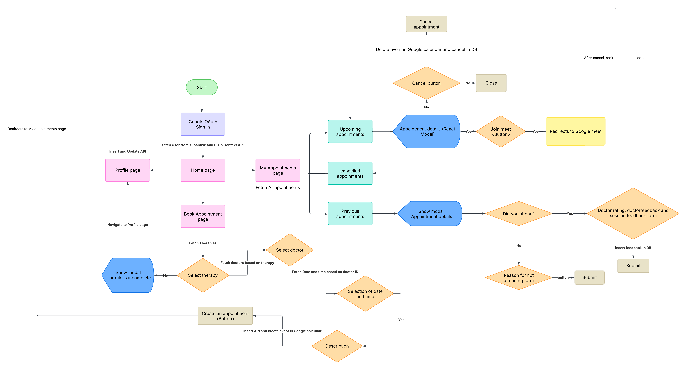

# Therahub Docs

This repo contains the source code and documentation of `Therahub` - A therapy appointment web app. 

This app has three different repos specific to user portal(this repo), backend logic and therapist portal.
Check the following repos for backend and therapist portal codes respectively:

<a href="https://github.com/Nampallyrohith/therapy_appointment_server" target="_blank">Backend Repo</a>

<a href="https://github.com/Nampallyrohith/therahub-doctor-registration" target="_blank">Therapist Portal Repo</a>

You can visit the `user portal webpage` from the `about section` of this repo.

Check the `about section` of therapist portal repo given above to visit the `therapist portal webpage`

## Project Overview
### Description:
Therahub is a web-based application that enables users to schedule, manage, and cancel therapy appointments efficiently. It supports multiple user roles, appointment tracking, schedule managing and reason-based cancellations.

### Tech Stack:
  - Frontend: Vite + React.js + Tailwind CSS
  - Backend: Node.js, Express.js
  - Database: PostgreSQL (Supabase)
  - Deployment: Netlify, Render.com

### Component libraries:
  - Chakra UI (User portal)
  - ShadCN (Therapist portal)
  - React Icons

### Target Audience:
  - Our primary audience include `individuals` seeking therapy sessions and `therapists` who want to manage their schedules

## Features & Functionality
### User Roles:
  - **Patients** - Book and cancel appointments based on slot availability.

  - **Therapists** - Manage slot availability, view scheduled appointments.

  ### Core Features:
  - **Sign Up/Login and Authentication:** Signing in with `Google OAuth` using `Supabase` auth services.

  - **Appointment Booking:** Once users login, they can book an appointment (A Google meet) with the therapist of their choice. However, users must fill in some basic profile details to proceed with appointment scheduling.

  - **Handling Appointments:** Users can go to `My Appointments` section of the app to view or cancel their appointments. Cancelling an appointment needs a valid reason from the user.

  - **Availability Management:** This feature is specific to therapists. Therapists can manage their availability by selecting leaves when they're unavailable. Sundays are holidays by default.

  - **Notifications and Google calendar events:** Booking or cancelling an appointment also handles `email notifications` and `creating/deleting Google calendar events` for both patients and therapists.

  - **Key API endpoints:**
    - `POST auth/google/signin` - <br />Sign up and create account directly with Google account in the initial signin, and simply login in every subsequent signin.

    - `POST appointment/create-event/:googleUserId` - <br /> Book an appointment and create a Google calendar event.

    - `POST appointment/cancel/:appointmentId` - <br /> Cancel an upcoming appointment

## Setup & Installation
### Prerequisites:
  1. Node.js
  2. Supabase (Storage bucket, db management, authentication)
  3. npm

### Installation:
<ins>Cloning the repo:</ins>
```bash
  git clone <repository-url>
  cd therapy-appointment-web
```
<ins>Install dependencies:</ins>
```bash
  npm install
```

<ins>Start the server:</ins>
```bash
  npm run dev
```

## Usage guide
### Home Page:
&nbsp;&nbsp; Home page has a header containing redirects to different app sections, a list of therapies for users to learn about to understand which category their issues fall under, and a list of therapists which they can choose from to schedule an appointment with.

### Accessing profile:
&nbsp;&nbsp; Users can access profile page by clicking on the `Profile` link in the app header.

### Booking an appointment:
&nbsp;&nbsp; Booking an appointment can be done in 3 ways:
  1. Click on the `Book Appointment` button in the app header (or elsewhere) to proceed with booking an appointment.
  2. Click on the `Book Therapy` button under a particular therapy type to pre-select therapy.
  3. Click on the `Schedule an appointment` button specific to each therapist to directly schedule a meet.

### Accessing appointments:
&nbsp;&nbsp; Users can access their appointments by clicking on the `My appointments` link in the app header. Each appointment is shown as a card containing brief details, clicking on a card opens a `modal` giving full details about the appointment.

### Cancelling an appointment:
&nbsp;&nbsp; Cancel an appointment by clicking on the `Cancel meet` button. This button is accessible from the appointment `modal`, which can be seen once a user clicks on an appointment card.

### Therapist Dashboard:
&nbsp;&nbsp; Therapist dashboard can be accessed from its repo. This dashboard enables therapists to view their schedule and handle their slot availability.

## Database Schema
### Key Tables:
  - Users - Stores user information (non-therapists)
  - Doctors - Stores therapist information
  - Appointments - Stores appointments and manages them
  - Appointment Feedback - Stores feedback data of appointments
  - Cancelled Appointments - Stores data related to cancelled appointments

## App Workflow


## Code Documentation
### Backend:
  - `src/`
    - `handlers/routes.ts` - Handles app routes
    - `schema/` - Contains database schemas
    - `services/db/queries.ts` - Contains database queries
    - `services/appointment.ts` - Contains database query calls, specific to appointments

### Frontend:
  - `src/`
    - `components/`
      - `AuthenticationPage.tsx` - Handles authentication logic
      - `BookAppointmen.tsx` - Handles booking appointment logic
      - `HomePage.tsx` - User Dashboard
    - `context/` - Holds app contexts
    - `/Handler/ProtectedRoute.tsx` - Common protected route for sensitive routes
    - `/models/typeDefinitions.ts` - Holds app typedefs
    - `shared/` - Holds reusable components within the app
    - `supabase/`, `/services`, and `/hooks` - Contain backend-frontend connection logic

## Security & Privacy
  - We use Google auth for authentication and storing data in database that is necessary for creating an appointment and a google calendar event.
  - All user data used is solely utilized for authentication and creating calendar events.
  - Google auth is used only for user(patients) login, therapist sign-up and login is done through email and password (encrypted). 
  - Necessary therapist data is shown in user portal, for instance their experience, specialization so users can book a therapist of their choice.

## Deployment
Frontend - Netlify<br />
Backend - Render.com

## Future Enhancements & Maintenance
  - Features
    - Adding a badge to therapist cards to show therapist's average rating
    - Adding testimonials to homepage
    - Adding appointment reminders within the app
    - Integrating payment gateway for booking an appointment
  - Maintenance
    - Preventing users from creating multiple appointments in the same slot
    - Status change of doctor's leave dates from upcoming to previous
    - Regular bug fixes (UI + backend)
    - Performance optimizations